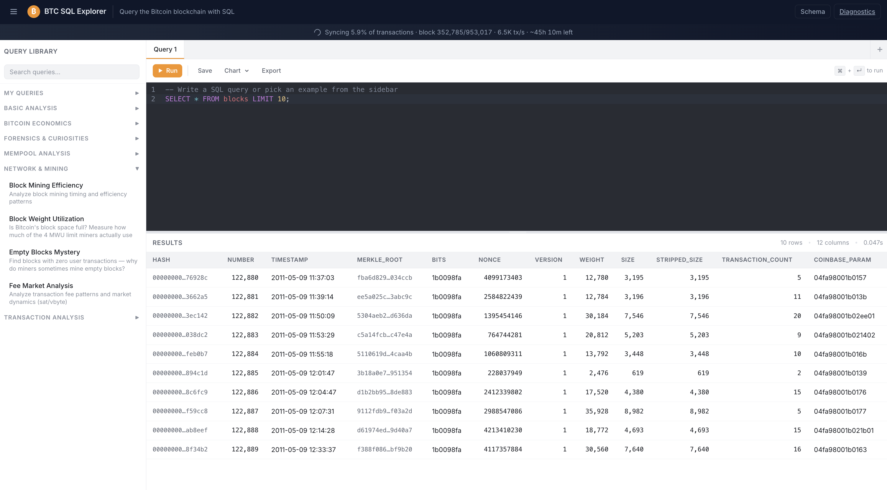
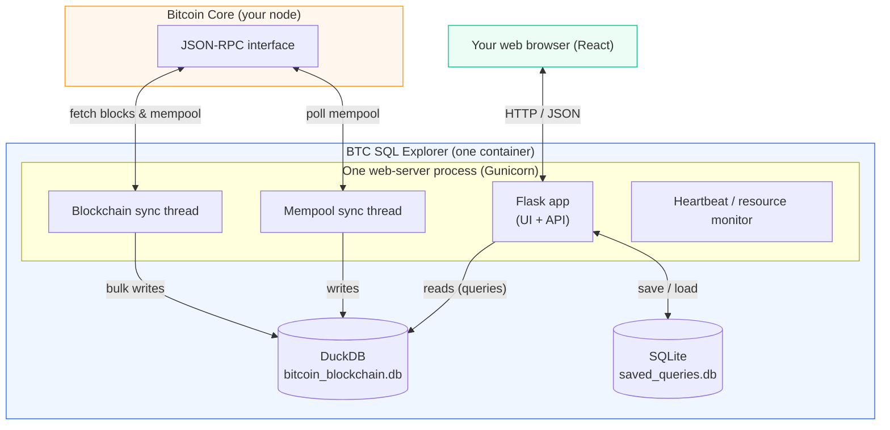
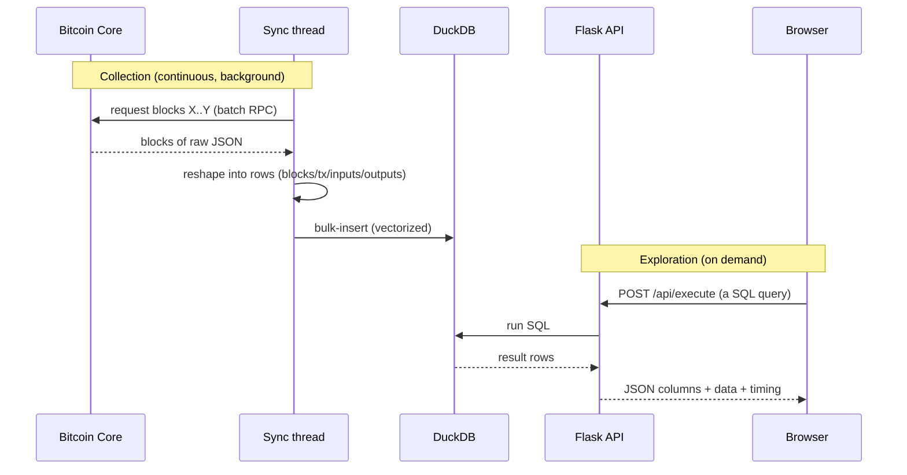
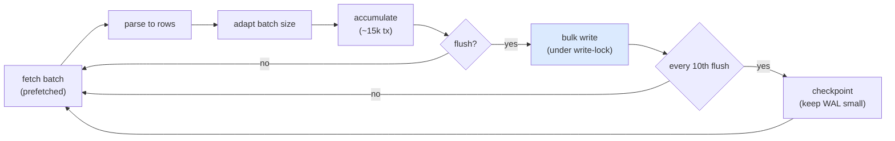
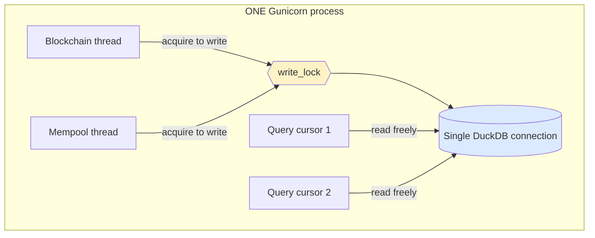
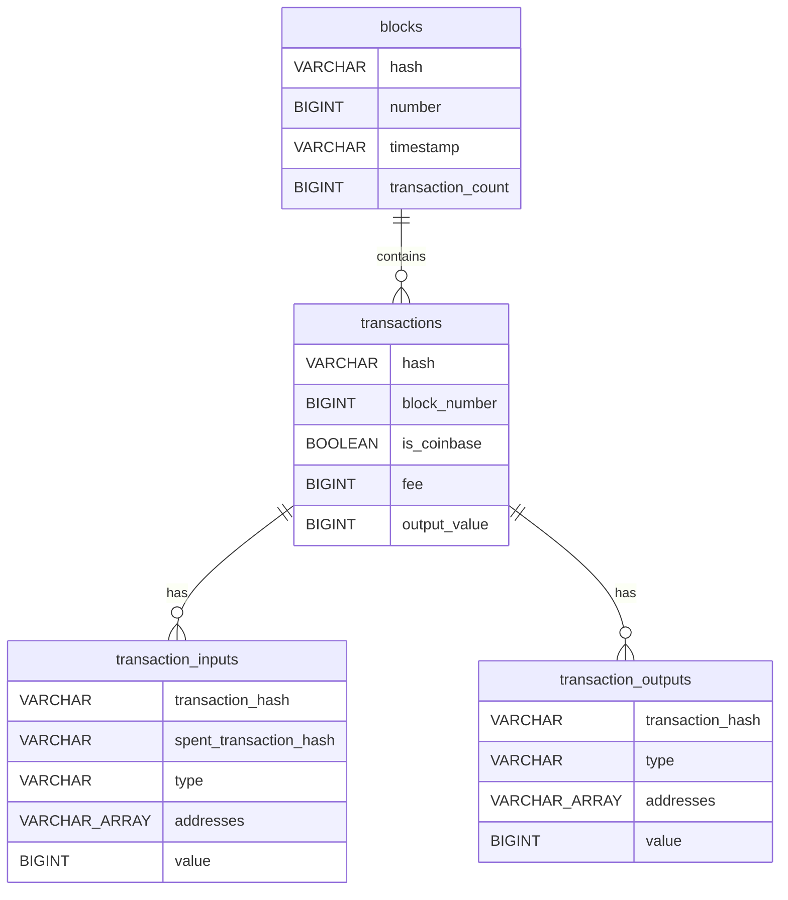
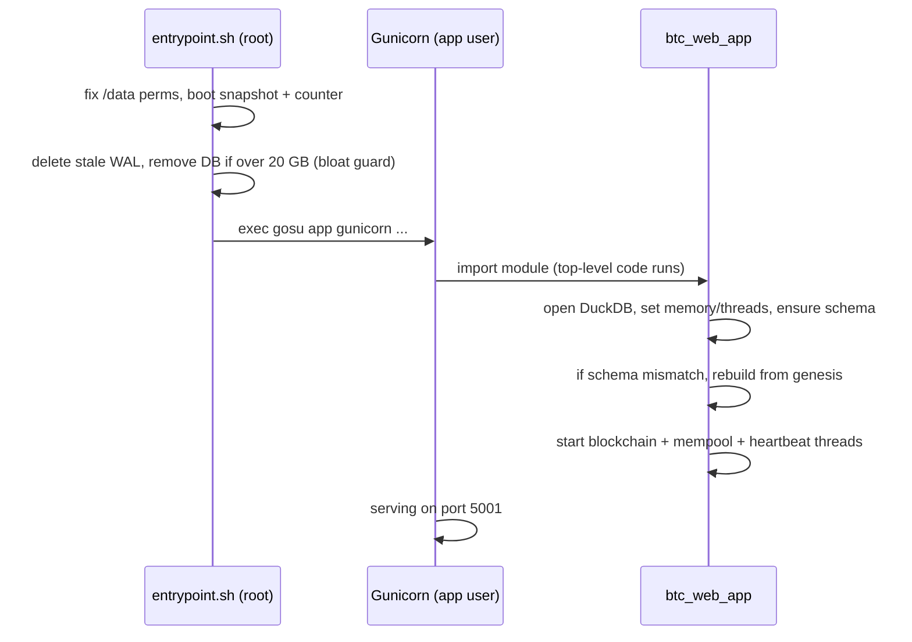

# ₿ BTC SQL Explorer

**Query your own Bitcoin node's blockchain with SQL — privately, on your own hardware.**

BTC SQL Explorer connects to a Bitcoin Core node via JSON-RPC, ingests blocks,
transactions, inputs, and outputs into a fast [DuckDB](https://duckdb.org)
analytical database, and gives you a modern web UI to explore it all with SQL —
plus a live view of the mempool. Your data never leaves your device.

> Run any query you can imagine against your *own* copy of the chain: fee
> markets, whale movements, mining patterns, script-type distributions, SegWit
> adoption, dust outputs, mempool congestion, and more.



---

## Features

- 🖊️ **SQL editor** with syntax highlighting (CodeMirror), multiple query tabs, and cancellable queries
- 📊 **Results table** with row/column counts and timing
- 📈 **Charts** — turn any result into a bar / line / area / scatter / pie chart (Plotly)
- 💾 **Saved queries** and a built-in **library of ~20 example queries** across 6 categories
- 🔎 **Schema browser** — every table and column at a glance
- ⛓️ **Real-time mempool** — query unconfirmed transactions and a rolling 7-day congestion history
- ⏳ **Non-blocking sync** — explore whatever data exists while the chain keeps syncing in the background
- 📥 **CSV export**
- 🩺 **Built-in diagnostics** — one-click downloadable log bundle for troubleshooting (see [Diagnostics](#diagnostics--logging))

---

## The big picture

The app is a single program with a few moving parts. The browser only ever
talks to the web server; the web server owns the database and the sync workers.



Key ideas:

- **Everything runs in one process.** The web server *and* the two sync workers
  (plus a heartbeat monitor) live inside the same Gunicorn process.
- **Two databases.** A big **DuckDB** file holds the chain/mempool data you
  query; a tiny **SQLite** file holds your saved queries — separate files, so a
  query-save never contends with the heavy sync.

---

## How it works

There are two independent loops: a **collection loop** (always pulling new data
from your node into DuckDB) and an **exploration loop** (your queries, on
demand). You don't wait for the sync to finish — you can query whatever's
already there.



The syncer is tuned for constrained home devices:

- **Batched RPC** — many blocks per HTTP request.
- **Adaptive batch sizing** — targets a constant ~5,000 tx/batch so early
  (tiny) and recent (dense) blocks both stay manageable.
- **Pipelined** — the next batch downloads while the current one is parsed/written.
- **Bulk vectorized inserts** via pandas DataFrames (`INSERT … SELECT * FROM df`).
- **Indexes dropped during bulk sync** and rebuilt at the end; **WAL
  checkpoints** kept small to avoid multi-second stalls.
- **Transaction-weighted progress** so the ETA stays honest as blocks get denser
  (block % races to ~25% then crawls — tx % is the real measure).



### Concurrency — one process, in-process MVCC

The single most important design choice. Three things touch the database at
once: the blockchain writer, the mempool writer, and your read queries. Running
the syncers as *separate processes* used to cause cross-process file-lock
contention ("database is busy"). The fix: **one process, one shared DuckDB
connection.** DuckDB's in-process **MVCC** lets many readers run concurrently
with a single writer — no file-lock fighting.



A single in-memory **`write_lock`** makes the two writer threads take turns;
**readers don't need the lock at all** (MVCC), so queries never block on the sync.

---

## Data model

All blockchain + mempool data lives in one DuckDB file. Bitcoin amounts are
stored in **satoshis** (integers) for exact math.



| Table | Description |
|---|---|
| `blocks` | One row per block (hash, height, timestamp, size, weight, tx count, coinbase message) |
| `transactions` | One row per tx (block_number, is_coinbase, input/output value, computed fee, sizes) |
| `transaction_inputs` | One row per input (source tx, type, address(es), value) |
| `transaction_outputs` | One row per output (`script_hex`, script type, address(es), value) |
| `mempool_transactions` | Current unconfirmed transactions (fully refreshed every 15s) |
| `mempool_snapshots` | Rolling 7-day history of mempool size/fee summaries |
| `v_transactions` *(view)* | `transactions` joined to `blocks` — adds `block_timestamp` and `block_hash`. Query this when you need a tx's block time/hash. |

To keep the database small, the `transactions` table is **denormalized-free**: it
stores only `block_number`, not the (derivable) `block_timestamp`/`block_hash`,
and `transaction_inputs` does not store raw scriptSig hex. Use the
**`v_transactions`** view (above) whenever you need block time or hash on a
transaction. Saved queries are kept in a **separate SQLite file** so they never
contend with the DuckDB sync.

---

## Quick start

### Option A — Umbrel (easiest)

Install **BTC SQL Explorer** from the community app store
([btc-sql-explorer-umbrel](https://github.com/ignaciofdezocana/btc-sql-explorer-umbrel)).
It depends on the Bitcoin Core app and wires up the RPC connection automatically.

### Option B — Docker, against your own node

```bash
docker run -d --name btc-sql-explorer \
  -p 5001:5001 \
  -v btcsql-data:/data \
  -e BITCOIN_RPC_HOST=<your-node-ip> \
  -e BITCOIN_RPC_PORT=8332 \
  -e BITCOIN_RPC_USER=<rpc-user> \
  -e BITCOIN_RPC_PASS=<rpc-pass> \
  ignaciofdez/btc-sql-explorer:latest
```

Then open <http://localhost:5001>. To build the image yourself:

```bash
docker build -t btc-sql-explorer .
```

### Option C — Local development (with a throwaway testnet4 node)

`setup.sh` spins up a Bitcoin Core **testnet4** node in Docker, installs the
Python deps, and syncs:

```bash
./setup.sh
```

Or do it manually:

```bash
# 1. (optional) start a local testnet4 node
docker compose up -d            # bitcoin/bitcoin:29 on RPC :48332

# 2. backend
python3 -m venv .venv && source .venv/bin/activate
pip install -r requirements.txt gunicorn

# 3. frontend (build once; Flask serves frontend/dist)
cd frontend && npm install && npm run build && cd ..

# 4. run the app (starts sync threads + serves UI on :5001)
DB_PATH=./bitcoin_blockchain.db \
BITCOIN_RPC_PORT=48332 \
python btc_web_app.py
```

**Frontend hot-reload** (separate terminal, proxies `/api` → `:5001`):

```bash
cd frontend && npm run dev      # Vite dev server on :5173
```

---

## Configuration

All configuration is via environment variables.

| Variable | Default | Description |
|---|---|---|
| `BITCOIN_RPC_HOST` | `127.0.0.1` | Bitcoin Core RPC host |
| `BITCOIN_RPC_PORT` | `8332` | Bitcoin Core RPC port |
| `BITCOIN_RPC_USER` | `bitcoin` | RPC username |
| `BITCOIN_RPC_PASS` | `bitcoin` | RPC password |
| `BITCOIN_NETWORK` | `mainnet` | Network label |
| `DB_PATH` | `/data/bitcoin_blockchain.db` | DuckDB database file |
| `SAVED_QUERIES_PATH` | `/data/saved_queries.db` | SQLite file for saved queries |
| `LOG_LEVEL` | `INFO` | `DEBUG` for verbose RPC/fetch logging |
| `LOG_DIR` | `/data/logs` | Where rotating logs are written |
| `HEARTBEAT_SEC` | `15` | Resource/heartbeat log interval |

<details>
<summary>Performance tuning (match to your container's RAM/CPU)</summary>

| Variable | Default | Description |
|---|---|---|
| `DUCKDB_MEMORY_LIMIT` | `1536MB` | DuckDB memory cap (raise it if the container has headroom) |
| `DUCKDB_THREADS` | `2` | DuckDB worker threads (match to allotted CPUs) |
| `FLUSH_TX_THRESHOLD` | `15000` | Transactions accumulated before each bulk write (lower = less peak memory) |
| `WAL_WARN_MB` | `512` | Warn if the WAL grows past this (checkpointing stalled?) |
| `DB_BLOAT_WARN_MB_PER_1K` | `100` | Warn on excessive DB growth per 1k blocks |
| `RPC_SLOW_MS` | `5000` | Warn on RPC calls slower than this |
| `RPC_BIG_RESP_MB` | `50` | Warn on RPC responses larger than this |
| `FETCH_MAX_ATTEMPTS` | `4` | Retries (with backoff) per block-fetch batch |
| `CHECKPOINT_SLOW_MS` | `10000` | Warn on checkpoints slower than this |
| `NODE_HEALTH_EVERY_N_BATCHES` | `50` | How often to re-poll node health mid-sync |

</details>

---

## API reference

| Endpoint | Method | Description |
|---|---|---|
| `/api/execute` | POST | Run a SQL query → `{ columns, data, row_count, execution_time }` |
| `/api/schema` | GET | All tables and columns |
| `/api/stats` | GET | Row counts (blocks, transactions, inputs, outputs) |
| `/api/sync-status` | GET | Blockchain + mempool sync progress |
| `/api/examples` | GET | Built-in example query library |
| `/api/chart` | POST | Build a Plotly chart from a result set |
| `/api/export` | POST | Export rows as CSV |
| `/api/saved-queries` | GET/POST/PUT/DELETE | Manage saved queries |
| `/api/logs/download` | GET | Download the diagnostics bundle (zip) |

---

## Diagnostics & logging

Logs are timestamped (UTC) and written to **both** stdout and a rotating file
under `LOG_DIR` (`/data/logs/sync.log`), so they **survive container restarts**
— important for diagnosing crashes/OOM after the fact.

A **heartbeat** line is emitted every `HEARTBEAT_SEC` with live memory (process
RSS + cgroup usage vs. limit), WAL/DB size, disk free, and the current sync
phase/height, plus alarms for high memory, an un-checkpointed WAL, or DB bloat.

When something goes wrong, click **Diagnostics** in the top bar (or
`GET /api/logs/download`) to download a single zip containing the logs, status
files, and a system snapshot — everything needed to diagnose a stall (OOM,
poison batch, checkpoint stall, disk-full, or node issue).

---

## Startup sequence



---

## Project structure

```
btc_web_app.py        Flask app + API + starts sync/heartbeat threads
btc_sync.py           Blockchain syncer (RPC → DuckDB), adaptive batching, checkpoints
btc_mempool_sync.py   Mempool poller (every 15s)
logging_setup.py      Logging config + resource (cgroup/proc) helpers
gunicorn.conf.py      Gunicorn worker-lifecycle logging hooks
entrypoint.sh         Container startup: perms, WAL/bloat cleanup, boot snapshot
Dockerfile            Multi-stage build (frontend → Python runtime)
docker-compose.yml    Local testnet4 Bitcoin Core node (dev only)
setup.sh              One-command local dev setup
frontend/             React + Vite + TypeScript UI (CodeMirror editor, Plotly charts)
docs/                 Screenshots and documentation assets
```

---

## Tech stack

**Backend:** Python · Flask · Gunicorn · DuckDB · pandas
**Frontend:** React · Vite · TypeScript · CodeMirror · Plotly
**Infra:** Docker (multi-arch: linux/amd64 + linux/arm64)

---

## Privacy

The app talks only to *your* Bitcoin node over local RPC and stores its database
on *your* device. No blockchain data, queries, or analytics are sent anywhere.

---

*Developed by Ignacio Fernandez. Packaged for Umbrel at
[btc-sql-explorer-umbrel](https://github.com/ignaciofdezocana/btc-sql-explorer-umbrel).*
